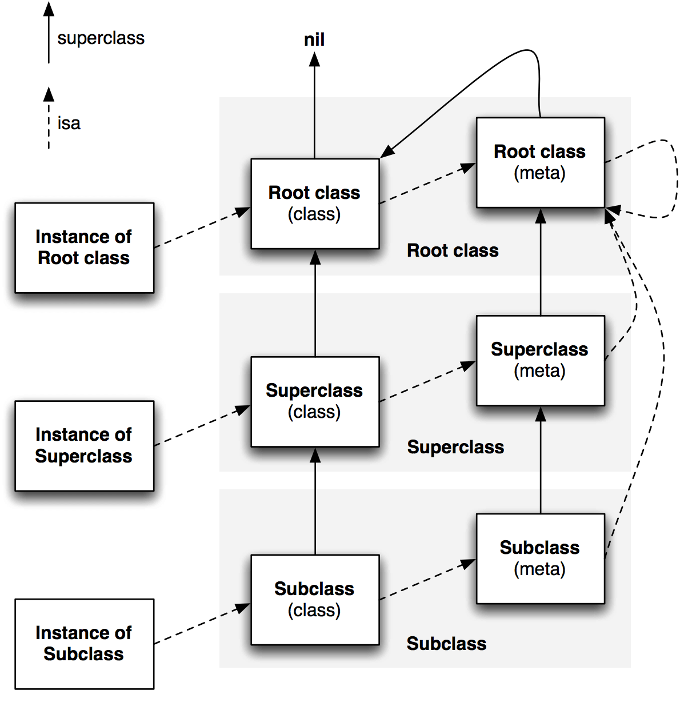

# Runtime 的結構與類別

## 基礎的結構與類別

如果是第一次看 runtime 相關的內容的話，這些步驟可能包含許多不清楚的屬性。接下來會藉由簡介幾個重要屬性的用意。

```cpp
//物件
struct objc_object {
    Class isa  OBJC_ISA_AVAILABILITY;
};
//類別
struct objc_class {
    Class isa  OBJC_ISA_AVAILABILITY;
#if !__OBJC2__
    Class super_class                                        OBJC2_UNAVAILABLE;
    const char *name                                         OBJC2_UNAVAILABLE;
    long version                                             OBJC2_UNAVAILABLE;
    long info                                                OBJC2_UNAVAILABLE;
    long instance_size                                       OBJC2_UNAVAILABLE;
    struct objc_ivar_list *ivars                             OBJC2_UNAVAILABLE;
    struct objc_method_list **methodLists                    OBJC2_UNAVAILABLE;
    struct objc_cache *cache                                 OBJC2_UNAVAILABLE;
    struct objc_protocol_list *protocols                     OBJC2_UNAVAILABLE;
#endif
} OBJC2_UNAVAILABLE;

//方法列表
struct objc_method_list {
    struct objc_method_list *obsolete                        OBJC2_UNAVAILABLE;
    int method_count                                         OBJC2_UNAVAILABLE;
#ifdef __LP64__
    int space                                                OBJC2_UNAVAILABLE;
#endif
    /* variable length structure */
    struct objc_method method_list[1]                        OBJC2_UNAVAILABLE;
}   
                                                         OBJC2_UNAVAILABLE;
//方法
struct objc_method {
    SEL method_name                                          OBJC2_UNAVAILABLE;
    char *method_types                                       OBJC2_UNAVAILABLE;
    IMP method_imp                                           OBJC2_UNAVAILABLE;
}
```

### 類別 - objc\_class

Objective-C 的類別屬於 `Class` 類別，實際上是指向一個 `objc_class` 結構的指針。相關的源碼可以在 `objc/runtime.h` 裡查找。

```cpp
typedef struct objc_class *Class;
```

結構體定義如下

```cpp
struct objc_class {
    Class _Nonnull isa  OBJC_ISA_AVAILABILITY;

#if !__OBJC2__
    Class _Nullable super_class                              OBJC2_UNAVAILABLE;
    const char * _Nonnull name                               OBJC2_UNAVAILABLE;
    long version                                             OBJC2_UNAVAILABLE;
    long info                                                OBJC2_UNAVAILABLE;
    long instance_size                                       OBJC2_UNAVAILABLE;
    struct objc_ivar_list * _Nullable ivars                  OBJC2_UNAVAILABLE;
    struct objc_method_list * _Nullable * _Nullable methodLists                    OBJC2_UNAVAILABLE;
    struct objc_cache * _Nonnull cache                       OBJC2_UNAVAILABLE;
    struct objc_protocol_list * _Nullable protocols          OBJC2_UNAVAILABLE;
#endif

} OBJC2_UNAVAILABLE;
```

從內容可以看出， `struct objc_class` 保存指向父類的指針 `super_class`、類別名稱、版本、instance 大小、變量列表、方法列表、緩存結構、還有協議列表等資訊。

從這裡可以看出這個結構就是包含一個類別內的信息內容，而**類別物件本身就是一個 `objc_class` 結構，這個結構儲存的數據稱為 metadata（元數據），該結構第一個變量也是 `isa` 指針。說明了 Class 本身也是一個物件 \(**_在 Objective-C 中，含有一個 isa 指針並且可以正確指向某個類別的數據結構，都可以視作為一個物件\)_**，這個物件稱為類別物件，在編譯時用於產生該類別的 instance，它也是個 singleton.**

### 物件\(實例\) - objc\_object

objc\_object 很單純，僅包含一個 isa 指針，指向用以產生該物件的類別物件。

```cpp
/// Represents an instance of a class.
struct objc_object {
    Class isa  OBJC_ISA_AVAILABILITY;
};

/// A pointer to an instance of a class.
typedef struct objc_object *id;
```

這段代碼也可以看出，`id` 是一個指向 `objc_object` 數據結構的指標

### Meta Class

Meta class 代表的是「描述類別」的類，就像定義一個類別的 class function, class variable 的類別。

下圖是 class 與 meta class 的關係圖



整個 Class 的體系是自成一個封閉環的，`struct objc_object` 結構物件的 `isa` 指針會指向類別物件，該類別物件的 `isa` 指針又指向 meta class。`super_class` 指針則指向父類的類別物件。而所有自 `NSObject` 繼承 meta class 都會包含一個 `isa` 指針指向 `NSObject` 的 meta class，也是所有該體系下的 root class。所以 `NSObject` 的 meta class 的 `isa` 指針是指向自己。

### 方法 - objc\_method

先看 `objc_method` 的定義

```cpp
typedef struct objc_method *Method;
struct objc_method {
    SEL method_name                                          OBJC2_UNAVAILABLE;
    char *method_types                                       OBJC2_UNAVAILABLE;
    IMP method_imp                                           OBJC2_UNAVAILABLE;
}
```

包含了 SEL 方法名、char \* 方法類型 以及 IMP 方法實現。

### SEL - objc\_selector

定義如下

```cpp
typedef struct objc_selector *SEL;
```

`SEL` 在 Objective-C 中的表示類型為 `selector`，在 Swift 中則是 `Selector`。所謂的 `selector` 就是方法選擇器，是用以區分方法的 **C 字符串**。 要取得這個字串可以藉由 `@selector()` 或者 `sel_registerName` 來得到一個  `SEL` 類型的方法選擇器。

`selector` 本質是一個 `string`，藉由方法的描述在 runtime 來進行 mapping 取得一個對應的識別符。因此我們可以理解為何 OC 裡，**同一個類別，方法不能 overload**。因為 `selector` 只記了 `method` 的 `name`，不包含參數，所以沒法區分 overload 的方法有什麼不同，編譯器會報錯。比如：

```objectivec
- (void)add(NSInteger)num;
- (void)add(CGFloat)num;
```

### IMP

定義如下

```cpp
/// A pointer to the function of a method implementation.
typedef id (*IMP)(id, SEL, ...);
```

`IMP` 是一個指向方法實現的指針，也就是最終實現程序的內存地址的指針。

### 類別緩存 - objc\_cache

當 `Runtime` 要查找一個物件的實現方法時，可能會發現 method list 含有大量的方法。然而一般來說，對於一個類別或物件實際會調用的方法可能僅占 20 %，因此如果每一次查找都從 method list 遍歷並不有效。所以 `objc_cache` 便是每次搜索結果後的緩存位置。所以實際運行時，大部分調用的方法其實都是從緩存查找來的，這使得 `Runtime` 運行速度非常快，接近直接執行內存地址的程序速度。

### Category - objc\_category

Category 表示一個指向分類結構體的指針，定義如下:

```cpp
struct category_t { 
    //這是 class_name 不是 category_name
    const char *name; 
    //要擴展的類別物件，編譯期間不會定義，在 Runtime 通過 name 對應
    classref_t cls; 
    struct method_list_t *instanceMethods; 
    struct method_list_t *classMethods;
    struct protocol_list_t *protocols;
    struct property_list_t *instanceProperties;
};

```


